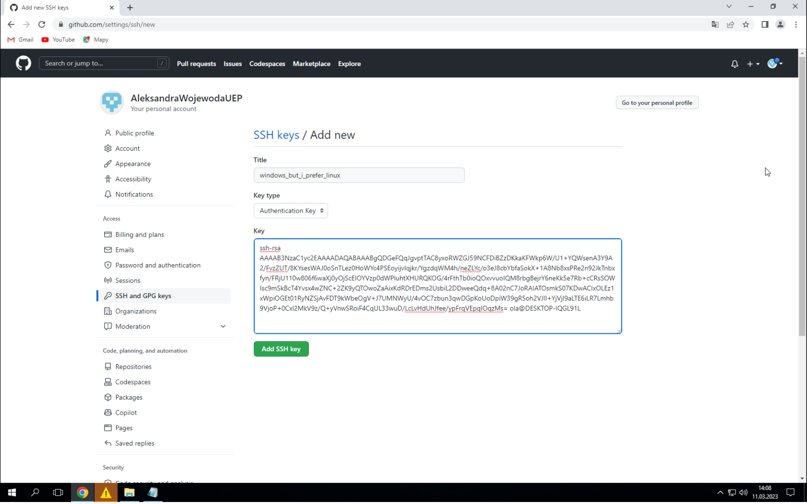

# Minimalistyczna instrukcja jak się zasetupować na zajęcia

## Założenie konta na [Githubie](https://github.com/)

Założenie konta nie powinno stanowić dla Państwa problemu :).

## Instalacja Git

Poniżej przedstawione zostały tutoriale do zainstalowania Gita dla wybranych systemów operacyjnych.
Nie są to jedyne istaniejące sposoby i użytkownik może korzystać z innych możliwych opcji.
Efektem oczekiwanym jest zainstalowany i działający Git.

### Dla systemu Windows

1. Pobranie [Gita dla Windowsa](https://git-scm.com/download/win).
**64-bit Git fo Windows Setup**.

2. Otwarcie pliku jeszcze z przeglądarki lub przejście do pobranego pliku za pomocą przeglądarki plików.


3. Uruchomienie pliku instalacyjnego. Wybranie opcji `Run`.


4. Zaakceptowanie licencji GNU GPL[^1]. Wybranie opcji `Next`.


5. `Select Components`. Zalecam wybranie wskazanych (domyślnych) opcji.


6. Wybór domyślnego edytora tekstu. 
Wybór ten bezpośrednio zależy od preferencji użytkownika.

- na zajęciach przez prowadzącego będzie wykorzystany głównie `vim` (wybór jak na screenie poniżej),
jednak nie jest on wymagany przez prowadzącego,
- łatwiejszym (nieterminalowym) wyborem będzie `Notepad++` lub inny znany użytkownikowi edytor z
listy wybieranej, 
- czymś między `vim` a edytorem w okienku (np. `Notepad++`) będzie `nano`, polecany dla osób,
które chcą edytor w terminalu, ale `vim` im (jeszcze :) ) nie odpowiada. 

Prowadzący w miarę mozliwości czasowych na zajęciach będzie wspierał wszystkie 3 opcję w przypadku 
problemów, które mogą pojawić się na zajęciach.

P.S. Uprzejmie przypominam, że to nie jest wybór na całe życie. Zawsze można zmienić domyślny edytor :).


"The only gym where it's possible to quit"


7. Wybór nazwy głównej gałeźni (z ang. `branch`). Jakiś czas temu dokonano przejścia z nazwy `master`
na nazwę `main`. Wybór należy do użytkownika, jednak zgodnie z głównym nurtem będzie wybranie `main`. 
Na zajeciach przykłady będą wykorzystywały `main` jako główną gałąź.


8. `Adjusting your PATH environment` 

- na zajęciach prezentowane będą opcje które wymagają także uniksowych narzędzi (tak jak na screenie),
- pozostałe opcje pozwolą przejść przez ćwiczenia na zajęciach, także opcja wybrana na screenie nie jest
opcją obowiązkową,
- opcja `Use Git from Bash only` jest szczególnie polecana, jeśli użytkownik chce nie ingerować w `PATH`.


9. `Choosing the SSH executable`


Użytkownik może zdecydować się na opcję o wyborze zewnętrzego `OpenSSH`.

10. `Choosing HTTPS transport backend`


11. `Configuring the line ending conversions`


12. `Configuring the terminal emulator to use with Git Bash`


13. `Choose the default behavior of git pull`

Pytanie z odpowiedzią typu "to zależy". W pierwszej fazie polecam opcję domyślą (jak na screenie).
Wraz ze wzrostem umiejętności korzystania z Gita łatwiejsze będzie zrozumienie pozostałych dostępnych opcji
oraz ich wykorzystanie w praktyce. Użytkownik może przejść przez zajęcia wykorzystując dowlne ustawienie.


14. `Choose a credential helper`


15. `Configuring extra options` i `Configuration expermiental option`

Generalnie dodatkowe opcje zależą od preferencji użytkownika, dla potrzeb zajęć można przeklikać opcje 
domyślne (screeny poniżej). Użytkownik może dobrać dodatkowe konfiguracje według własnego uznania.


16. Następnie powinien pojawić się pasek instalacji, a potwierdzeniem zainstalowania będzie:


#### Podsumowanie

Gratulację! Na Twoim Windowsie jest Git.

### Dla systemu Ubuntu/Debian

Nieobowiązkowe, ale zalecane (zaktualizowanie paczek):

```
sudo apt update
sudo apt upgrade
```

Instalacja Gita:

```
sudo apt install git
```

Dla innych linuksowych dystrybucji jest równie łatwo.

Sprawdzenie, czy Git się zainstalował:

```
git --version
```

Przykładowy oczekiwany rezultat:


(1:0 dla Linuxa)

### Dla macOS za pomocą `homebrew`

Instalacja:

```
brew install git
```

Sprawdzenie, czy instalacja się powiodła:

```
git --version
```

Oczekiwanym rezulattem jest informacja o wersji oporgramowania Git na danej maszynie
(podobnie jak dla Linuxa).

### Podsumowanie

Więcej dostępnych informacji o pobieraniu Gita jest dostępnych na oficjalnej 
[stronie internetowej Gita](https://git-scm.com/downloads).

## Konfigracji Gita lokalnie

Dla wszystkich systemów operacyjnych operacja ta powinna wyglądać tak samo.
W Windowsie wybieramy `Git BASH`. W Linuxie/Macu terminal.

Ustawienie nazwy i maila użytkownika:

```
git config --global user.name "Imię Nazwisko"
git config --global user.email "niu@ue.poznan.pl"
```

W odpowiednich miejscach wpisz swoje dane. Przełącznik `--global` nie jest wymagany, 
szczególnie w przypadku wykorzystywania jednej maszyny dla wielu użyrkoników Gita.
Przykładowo użytkownik uczelniany, prywatny i służbowy.
Można stworzyć konfigurację, która zezwala na odseparowanie od siebie kont Gitowych[^2].

W przypadku ewentualnego błędu/literówki polecenie można wykonac ponownie.

> **_Tip:_**  Będąc w terminalu (lub emulatorze terminala) strzałka w górę pozwala na przywołanie komend.
Szczególnie przydatne jeśli chcemy danej komendy użyć dwa razy lub komendy są od siebie nieznacznie róźne, 
więc "nie opłaca" się jej przepisywać. 


Aby sprawdzić wprowadzone dane można w katalogu użytkownika sprawdzić plik `.gitconfig`.

**Uwaga! Następujące komendy są uniksowe, więc mogą nie działać dla Git CMD, ale będą dla Git BASH**

W terminalu wpisz `pwd`. Komenda ta wyświetla ścieżkę dostępu do bieżącego katalogu. 
Dla Windowsa powinna być `/c/User/<nazwa użytkownika>` dla Linuxa `/home/<nazwa użytkownika>`.
Jeśli nie jesteś w tym katalogu komenda `cd` sprowadzi cię do katalogu domowego (czyli katalogu użytkownika).
W katalogu domowym jest ukryty[^3] plik `.gitconfig`. 
Do pliku można zajrzeć z poziomu terminala np.:

- jedynie podgląd: komenda `cat .gitconfig` (komenda `cat` wyświetla zawartość danego pliku),
- w trybie edycji: komenda `nano .gitconfig` (wyjście z programu ctrl + x) lub `vim .gitconfig` (vim w trybie
wyświetlania, aby edytować wybierz i, aby wyjść z tryby edycji esc, aby wyść z programu wyjdź z trybu edycji
esc, aby wyjść z niemodyfikowanego pliku 
:q, z modyfikowanego, ale bez zapisu :q!, zapisz i wyjdź :wq),

> **_Tip:_** Wpisz do terminala `cat .gitc` i wciśniej tab. Nazwa pliku powinna samodzielnie się uzupełnić.
Tab uzupełnia komendy/nazwy plików jeśli jest to możliwe.


## Wygenerowanie klucza SSH

Klucz SSH będzie potrzebny do połączenia lokalnego setupu z kontem na Githubie.
Uwierzytelnianie może odbyć się na wiele oposobów. Za pomocą tokena, klucza SSH, czy 
klucza GPG. Do tego jeszcze kwestia szyforwania. Na zajęciach dozwolona jest dowolna 
metoda, ale dla początkujących tutorial będzie przechodził przez proces ustawiania
uwierzetylniania za pomocą klucza SSH. 

Do wygenerowania klucza SSH służy komenda `ssh-keygen`. Na terminalu powinno wyświetlić się pytanie
o nazwę plików zawierających parę klucz publiczy i prywatny. Enter pozowli na wybranie opcji domyślnej.
Jeśli użytkownik posiada juz klucz o nazwie domyślnej można nadpisać plik lub użyć istniejącego klucza, 
lub wybrać inną nazwę dla pary. 
**Ten sam klucz SSH nie może zostać wykorzystany do dwóch kont na Githubie.** 
(Konfiguracja wielu użytkowników dla jednej maszyny [^2]).
Przez kolejne opcje także można przejść Enterem. Operacja zakończona powodzeniem wyświetli `randomart image`.


(Czy można podzielić się swoim `randomart image`?[^4])

Klucze trzymane są w katalogu ukrytym[^3] `.ssh`. Można sprawdzić ich obecnośc przechodząc do katalogu 
`.ssh`, który znajduje się w katalogu domowym (komenda sprawdzająca do katalogu domowego: `cd`).
W katalogu `.ssh` wykonaj komendą `ls` (lub `ls -l` - wyświetl listę ze szczegółami,
wtedy każdy plik jest w osobnej linii). W katalogu powinny znajdować się pliki `id_rsa` i `id_rsa.pub`.
Pierwszy to klucz prywatny - tego nigdzie nie publikujemy/dodajemy/dzielimy się. Drugi plik to klucz
publiczny, to go będziemy dodawać do konta na Githubie.


> **_Tip:_** Na screenie jak przeszłam z katalogu domowego do katalogu `.ssh`, 
po operacji przejścia widać jak zmianiła się nazwa katalogu w znaku zachęty (źółta część). 
Znak zachęty w ustawieniach domyślnych Git BASH dla Windowsa będzie wyświetlał katalog
w którym obecnie się znajdujemy. Znak zachęty może wyglądać różnie na wszystkich systemach, 
jest w pełni modyfikowalny.
Bardzo częto jednak domyślnie jest tego samego koloru co teskt wpisywany przez użytkownika,
jednak jak wcześniej wspomniano można to zmodyfikować[^2]. 

## Połączenie konta na Githubie z lokalnym setupem

1. Wejście w ustawienia (`Settings`) z paska wybieranego w prawym górnym roku na UI Githuba.


2. Wejście w `SSH and GPG keys` w lewym pasku i wybranie `New SSH key`


3. Przejdź do przeszukiwacza plików (ang. `Files explorer`) i przejdź do folderu `.ssh`.
W folderze powinny znajdować się klucze `id_rsa` i `id_rsa.pub`. **UWAGA! W nowszych Windowsach
w explorerze plików nie widać rozszerzenia klucza publicznego, można go poznać po ikonce z małym
`P`.** Najedź myszką na klucz publiczny i kliknij drugim przyciskiem myszki. `Otwórz za pomocą...`
i wybierz edytor tekstu, np. Notatnik. Skopiuj zawartość (crtl + A, ctrl + C).


4. Nadaj kluczowi nazwę. Nazwa powinna wskazywać na maszynę, z której pochodzi klucz. W moim przypadku
koncepcja nazywania kluczy to `jumper_<marka_laptopa>_<dopisek>`, jednak sposób nazwania klucza zależy
od użytkonika i nie musi mapować się do sugestii z podpunktu lub z screena. 
Do formularza w polu `Key` wklej swój klucz publiczny. 




[^1]: *GNU General Public License* jest wirusową licencją open-sourcową, która zobowiązuje
dostawców oprogramowania do dostarczenia kodu źródłowego oprogramowania użytkownikowi. 
[^2]: Zagadnienie dla chętnych realizowane indywidialnie na dyżurach lub po wcześniejszym umówieniu
się z prowadzącym.
[^3]: Ukryty plik (lub katalog) to plik, który domyślnie nie jest wyświetlany. 
Nazwa pliku zawiera na przedzie `.`. Wpisz komendę `ls` (wylistuj pliki) w terminal, następnie wpisz
komendę `ls -a` (wylistuj wszystkie pliki). W przypadku pierwszego ukryte pliki nie zostaną wyświetlone.
[^4]: [Link](https://superuser.com/questions/1621434/can-you-publish-your-ssh-key-randomart)
